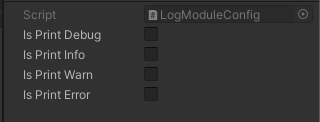
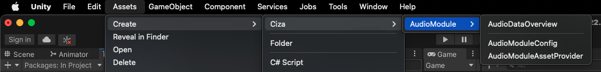
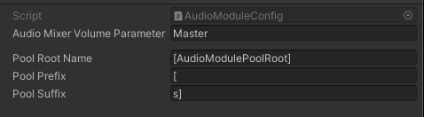
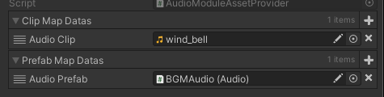
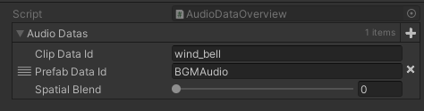

## Info
Modules for unity.

module | Status |
--- | --- |
[AddressablesModule](#addressablesmodule) | ✔️ |
[LocaleModule](#localemodule) | ✔️ |
[LocaleAddressablesModule](#localeaddressablesmodule) | ✔️ |
[TextModule](#textmodule) | ✔️ |
[TimerModule](#timermodule) | ✔️ |
[AudioModule](#audiomodule) | ✔️ |
[InputModule](#inputModule) | ✔️ |


## AddressablesModule
```
https://github.com/Ciza2596/GenericModule.git?path=Assets/Plugins/Ciza/AddressablesModule/AddressablesModule
```
### Dependency:
```
https://github.com/Ciza2596/Async.git?path=Assets/Plugins/Ciza/Async/Async
```

### Manual:
Dependency [UniTask](https://github.com/Cysharp/UniTask) and [Addressables](https://docs.unity3d.com/Packages/com.unity.addressables@1.21/manual/index.html).

- **Example**
```csharp
public class AddressablesModuleExample : MonoBehaviour
{
    private void Awake()
    {
    }
}
```
- **Operate Editor**
    1. Open AddressblesAssetManager:
    
       
    
    2. Export Page:
    
       
       
    3. Import Page:
    
       
       
    4. Add Page:
    
       

## LocaleModule
```
https://github.com/Ciza2596/GenericModule.git?path=Assets/Plugins/Ciza/LocaleModule/LocaleModule
```

### Dependency:
```
https://github.com/Ciza2596/Async.git?path=Assets/Plugins/Ciza/Async/Async
```

### Manual:
LocaleModule manual.


## LocaleAddressablesModule
```
https://github.com/Ciza2596/GenericModule.git?path=Assets/Plugins/Ciza/LocaleAddressablesModule/LocaleAddressablesModule
```
### Dependency:
```
https://github.com/Ciza2596/Async.git?path=Assets/Plugins/Ciza/Async/Async
```
```
https://github.com/Ciza2596/GenericModule.git?path=Assets/Plugins/Ciza/AddressablesModule/AddressablesModule
```
```
https://github.com/Ciza2596/GenericModule.git?path=Assets/Plugins/Ciza/LocaleModule/LocaleModule
```


## TextModule
```
https://github.com/Ciza2596/GenericModule.git?path=Assets/Plugins/Ciza/TextModule/TextModule
```

### Manual:
TextModule manual.


## TimerModule
```
https://github.com/Ciza2596/GenericModule.git?path=Assets/Plugins/Ciza/TimerModule/TimerModule
```

### Manual:
- **Example**
```csharp
using CizaTimerModule;
using UnityEngine;

public class TimerModuleExample : MonoBehaviour
{
    private TimerModule _timerModule;

    // unity callback
    private void Awake()
    {
        _timerModule = new TimerModule();
        _timerModule.Initialize();

        var timerId = _timerModule.AddLoopTimer(1, SayHello); // Call SayHello method every second.
        _timerModule.RemoveTimer(timerId);
    }

    private void Update() =>
        _timerModule.Tick(Time.deltaTime);

    // private method
    private void SayHello(ITimerReadModel timerReadModel) =>
        Debug.Log("Hello!");
}
```

## AudioModule
```
https://github.com/Ciza2596/GenericModule.git?path=Assets/Plugins/Ciza/AudioModule/AudioModule
```
### Dependency:
```
https://github.com/Ciza2596/Async.git?path=Assets/Plugins/Ciza/Async/Async
```
```
https://github.com/Ciza2596/GenericModule.git?path=Assets/Plugins/Ciza/TimerModule/TimerModule
```

### Manual:

- **Operate AudioModuleConfig**
  1. Create AudioModuleConfig:
    
     
    
  2. AudioModuleConfig Inspector:
    
     
     
  3. AudioModuleAssetProvider Inspector:
    
     
     
  4. AudioDataOverview Inspector:
    
     
     
- **Example**
```csharp
using CizaAudioModule;
using CizaAudioModule.Implement;
using UnityEngine;
using UnityEngine.Audio;

public class AudioModuleExample : MonoBehaviour
{
    [SerializeField] private AudioDataOverview _audioDataOverview;
    [Space] 
    [SerializeField] private AudioMixer _audioMixer;
    [SerializeField] private AudioModuleConfig _audioModuleConfig;
    [SerializeField] private AudioModuleAssetProvider _audioModuleAssetProvider;

    private AudioModule _audioModule;
    
    private async void Awake()
    {
        _audioModule = new AudioModule(_audioModuleConfig, _audioModuleAssetProvider, _audioMixer);

        var audioDataMap = _audioDataOverview.GetAudioDataMap();
        await _audioModule.Initialize(audioDataMap);

        var audioId = _audioModule.Play("wind_bell");
        _audioModule.Stop(audioId);
    }
}
```

## InputModule
```
https://github.com/Ciza2596/GenericModule.git?path=Assets/Plugins/Ciza/InputModule/InputModule
```

### Dependency:
```
https://github.com/Ciza2596/GenericModule.git?path=Assets/Plugins/Ciza/TimerModule/TimerModule
```
```
Unity.InputSystem
```

### Manual:
InputModule manual.

