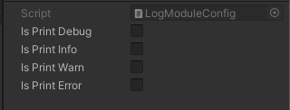

## Info
Modules for unity.

module | Test |
--- | :---: |
[LogModule](#logmodule) | ✔️ |
[PageModule](#pagemodule) | ✔️ |
[TimerModule](#timermodule) | ✔️ |
[AudioModule](#audiomodule) | ✔️ |
[EventModule](#eventmodule) | ✔️ |
[SaveLoadModule](#saveloadmodule) | ✔️ |
[ObjectPoolModule](#objectpoolmodule) | ✔️ |
[GameObjectPoolModule](#gameobjectpoolmodule) | ✔️ |
[SceneModule](#scenemodule) | ❌ |
[AudioPlayerModule](#audioplayermodule) | ❌ |
[AddressablesModule](#addressablesmodule) | ❌ |

## LogModule
```
https://github.com/Ciza2596/GenericModule.git?path=Assets/GenericModule/LogModule
```

### Manual:

- **Operate LogModuleConfig**
  1. Create LogModuleConfig:
    
     
    
  2. LogModuleConfig Inspector:
    
     
     
- **Example**
```csharp
using CizaLogModule;
using CizaLogModule.Implement;
using UnityEngine;

public class LogModuleExample : MonoBehaviour
{
    [SerializeField]
    private LogModuleConfig _logModuleConfig;
    
    private void Awake()
    {
        var logModule = new LogModule(_logModuleConfig, new UnityLogPrinter());
        logModule.Debug("Hello World!");
    }
}
```


## PageModule
```
https://github.com/Ciza2596/GenericModule.git?path=Assets/GenericModule/PageModule
```
### Dependency:
```
https://github.com/Cysharp/UniTask.git?path=src/UniTask/Assets/Plugins/UniTask
```

### Manual:
Dependency [UniTask](https://github.com/Cysharp/UniTask)

PageModule manual.


## TimerModule
```
https://github.com/Ciza2596/GenericModule.git?path=Assets/GenericModule/TimerModule
```

### Manual:
- **Example**
```csharp
using CizaTimerModule;
using UnityEngine;

public class TimerModuleExample : MonoBehaviour
{
    private TimerModule _timerModule;

    // unity callback
    private void Awake()
    {
        _timerModule = new TimerModule();
        _timerModule.Initialize();

        var timerId = _timerModule.AddLoopTimer(1, SayHello); // Call SayHello method every second.
        _timerModule.RemoveTimer(timerId);
    }

    private void Update() =>
        _timerModule.Tick(Time.deltaTime);

    // private method
    private void SayHello(ITimerReadModel timerReadModel) =>
        Debug.Log("Hello!");
}
```

## AudioModule
```
https://github.com/Ciza2596/GenericModule.git?path=Assets/GenericModule/AudioModule
```
### Dependency:
```
https://github.com/Cysharp/UniTask.git?path=src/UniTask/Assets/Plugins/UniTask
```

### Manual:
Dependency [UniTask](https://github.com/Cysharp/UniTask)

- **Operate AudioModuleConfig**
  1. Create AudioModuleConfig:
    
     
    
  2. AudioModuleConfig Inspector:
    
     
     
  3. AudioModuleAssetProvider Inspector:
    
     
     
  4. AudioDataOverview Inspector:
    
     
     
- **Example**
```csharp
using CizaAudioModule;
using CizaAudioModule.Implement;
using UnityEngine;
using UnityEngine.Audio;

public class AudioModuleExample : MonoBehaviour
{
    [SerializeField] private AudioDataOverview _audioDataOverview;
    [Space] 
    [SerializeField] private AudioMixer _audioMixer;
    [SerializeField] private AudioModuleConfig _audioModuleConfig;
    [SerializeField] private AudioModuleAssetProvider _audioModuleAssetProvider;

    private AudioModule _audioModule;
    
    private async void Awake()
    {
        _audioModule = new AudioModule(_audioModuleConfig, _audioModuleAssetProvider, _audioMixer);

        var audioDataMap = _audioDataOverview.GetAudioDataMap();
        await _audioModule.Initialize(audioDataMap);

        var audioId = _audioModule.Play("wind_bell");
        _audioModule.Stop(audioId);
    }
}
```


## EventModule
```
https://github.com/Ciza2596/GenericModule.git?path=Assets/GenericModule/EventModule
```
### Dependency:
```
https://github.com/Cysharp/UniTask.git?path=src/UniTask/Assets/Plugins/UniTask
```

### Manual:
Dependency [UniTask](https://github.com/Cysharp/UniTask)

- **Example**
```csharp
public class EventModuleExample : MonoBehaviour
{
    private void Awake()
    {
    }
}
```


## SaveLoadModule
```
https://github.com/Ciza2596/GenericModule.git?path=Assets/GenericModule/SaveLoadModule
```

### Manual:
Can use on field and property. Not include - public/protected/private type propertyName { get; }

Support type:
  1. Primitive: bool, char, dateTime, double, enum, float, int, long, short, string
  2. Collection: array, array2D, array3D, dictionary, hashset, list, queue, stack
  3. Unity: vector2, vector2Int, vector3, vector3Int

- **Example**

- **Operate SaveModuleConfig**
    1. Create SaveModuleConfig:
    
       
    
    2. SaveModuleConfig Inspector:
    
       
       
       
## ObjectPoolModule
```
https://github.com/Ciza2596/GenericModule.git?path=Assets/GenericModule/ObjectPoolModule
```

### Manual:
ObjectPoolModule manual.


## GameObjectPoolModule
```
https://github.com/Ciza2596/GenericModule.git?path=Assets/GenericModule/GameObjectPoolModule
```

### Manual:
GameObjectPoolModule manual.


## SceneModule
```
https://github.com/Ciza2596/GenericModule.git?path=Assets/GenericModule/SceneModule
```

### Manual:
SceneModule manual.


## AudioPlayerModule
```
https://github.com/Ciza2596/GenericModule.git?path=Assets/GenericModule/AudioPlayerModule
```
### Dependency:
```
https://github.com/Ciza2596/GenericModule.git?path=Assets/GenericModule/AudioModule
```

### Manual:
Dependency [AudioModule](#audiomodule)

AudioPlayerModule manual.

## AddressablesModule
```
https://github.com/Ciza2596/GenericModule.git?path=Assets/GenericModule/AddressablesModule
```
### Dependency:
```
https://github.com/Cysharp/UniTask.git?path=src/UniTask/Assets/Plugins/UniTask
```

### Manual:
Dependency [UniTask](https://github.com/Cysharp/UniTask) and [Addressables](https://docs.unity3d.com/Packages/com.unity.addressables@1.21/manual/index.html).

- **Example**
```csharp
public class AddressablesModuleExample : MonoBehaviour
{
    private void Awake()
    {
    }
}
```
- **Operate Editor**
    1. Open AddressblesAssetManager:
    
       
    
    2. Export Page:
    
       
       
    3. Import Page:
    
       
       
    4. Add Page:
    
       
