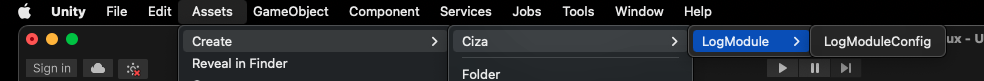

## Info
Modules for unity.

module | Test |
--- | :---: |
[LogModule](#logmodule) | ✔️ |
[PageModule](#pagemodule) | ✔️ |
[AudioModule](#audiomodule) | ✔️ |
[EventModule](#eventmodule) | ✔️ |
[SaveLoadModule](#saveloadmodule) | ✔️ |
[GameObjectPoolModule](#gameobjectpoolmodule) | ✔️ |
[SceneModule](#scenemodule) | ❌ |
[AudioPlayerModule](#audioplayermodule) | ❌ |
[AddressablesModule](#addressablesmodule) | ❌ |

## LogModule
```
https://github.com/Ciza2596/GenericModule.git?path=Assets/GenericModule/LogModule
```

### Manual:

- **Example**
```csharp
public class LogModuleExample : MonoBehaviour
{
    [SerializeField]
    private LogModuleConfig _logModuleConfig;
    
    private void Awake()
    {
        var logModule = new LogModule.LogModule(_logModuleConfig, new UnityLogPrinter());
        logModule.Debug("Hello World!");
    }
}
```
- **Operate LogModuleConfig**
  1. Create LogModuleConfig:
    
     
    
  2. LogModuleConfig Inspector:
    
     
     
  3. Drop LogModuleConfig to script:
    
     


## PageModule
```
https://github.com/Ciza2596/GenericModule.git?path=Assets/GenericModule/PageModule
```
### Dependency:
```
"https://github.com/Cysharp/UniTask.git?path=src/UniTask/Assets/Plugins/UniTask"
```

### Manual:
Dependency [UniTask](https://github.com/Cysharp/UniTask)

PageModule manual.


## AudioModule
```
https://github.com/Ciza2596/GenericModule.git?path=Assets/GenericModule/AudioModule
```

#### Manual:
AudioModule manual.


## EventModule
```
https://github.com/Ciza2596/GenericModule.git?path=Assets/GenericModule/EventModule
```
### Dependency:
```
"https://github.com/Cysharp/UniTask.git?path=src/UniTask/Assets/Plugins/UniTask"
```

### Manual:
Dependency [UniTask](https://github.com/Cysharp/UniTask)

- **Example**
```csharp
public class EventModuleExample : MonoBehaviour
{
    private void Awake()
    {
    }
}
```


## SaveLoadModule
```
https://github.com/Ciza2596/GenericModule.git?path=Assets/GenericModule/SaveLoadModule
```

### Manual:
Can use on field and property. Not include - public/protected/private type propertyName { get; }

Support type:
  1. Primitive: bool, char, dateTime, double, enum, float, int, long, short, string
  2. Collection: array, array2D, array3D, dictionary, hashset, list, queue, stack
  3. Unity: vector2, vector2Int, vector3, vector3Int

- **Example**

- **Operate SaveModuleConfig**
    1. Create SaveModuleConfig:
    
       
    
    2. SaveModuleConfig Inspector:
    
       

## GameObjectPoolModule
```
https://github.com/Ciza2596/GenericModule.git?path=Assets/GenericModule/GameObjectPoolModule
```

### Manual:
GameObjectPoolModule manual.


## SceneModule
```
https://github.com/Ciza2596/GenericModule.git?path=Assets/GenericModule/SceneModule
```

### Manual:
SceneModule manual.


## AudioPlayerModule
```
https://github.com/Ciza2596/GenericModule.git?path=Assets/GenericModule/AudioPlayerModule
```
### Dependency:
```
https://github.com/Ciza2596/GenericModule.git?path=Assets/GenericModule/AudioModule
```

### Manual:
Dependency [AudioModule](#audiomodule)

AudioPlayerModule manual.

## AddressablesModule
```
https://github.com/Ciza2596/GenericModule.git?path=Assets/GenericModule/AddressablesModule
```
### Dependency:
```
"https://github.com/Cysharp/UniTask.git?path=src/UniTask/Assets/Plugins/UniTask"
```

### Manual:
Dependency [UniTask](https://github.com/Cysharp/UniTask) and [Addressables](https://docs.unity3d.com/Packages/com.unity.addressables@1.21/manual/index.html).

- **Example**
```csharp
public class AddressablesModuleExample : MonoBehaviour
{
    private void Awake()
    {
    }
}
```
- **Operate Editor**
    1. Open AddressblesAssetManager:
    
       
    
    2. Export Page:
    
       
       
    3. Import Page:
    
       
       
    4. Add Page:
    
       
